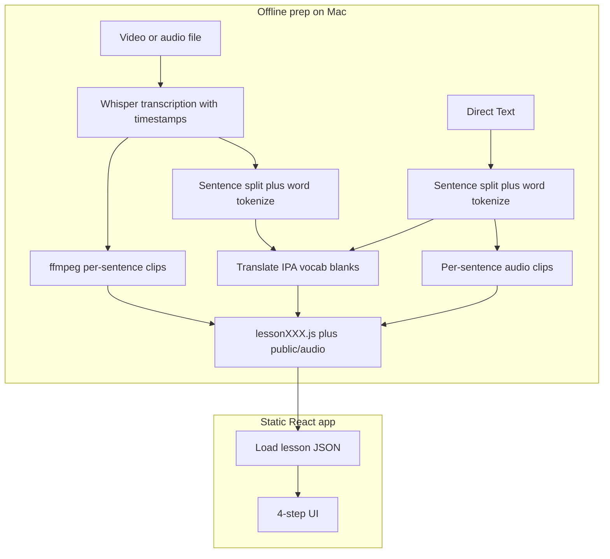

# English Geeks — Full Product Plan

> Accepted plan snapshot. Canonical Cursor plan with todos: `~/.cursor/plans/english_geeks_roadmap_52183208.plan.md`

## Current state vs your spec

You already have a solid skeleton in `[src/App.jsx](src/App.jsx)`, `[src/data/lesson001.js](src/data/lesson001.js)`, and `[src/utils/lcsMatch.js](src/utils/lcsMatch.js)`:

| Requirement | Status |
| ----------- | ------ |
| Title **English Geeks** / subtitle **英语极客** | Done via `lesson.title` / `lesson.subtitle` |
| 4 steps top-to-bottom (vocab → listen → practice → listen) | Layout exists; audio not wired |
| Sentence + word IDs, Chinese, word glosses, 3 blank levels | Schema in `lesson001.js`; only **3 demo sentences** (target **10–20**) |
| Word click popup | Done |
| Full Text (hold), Show Trans., Show IPA | Done |
| Speak + LCS green match | Partial; needs continuous STT until Stop + incremental LCS on updates |
| **Three practice cards in one place，selected by three tabs** (初/中/高) | **Done** |
| Prev and Next buttons for moving to previous or next sentence | Done |
| **For devices with touch screen, use vertical swipe for previous/next sentence, horizontal swipe to change levels.** | **Gap** |
| **IPA above each word** | **Gap**: sentence-level IPA string only |
| Per-sentence + full audio/video | **Gap**: `audioUrl` / `fullAudioUrl` empty |
| Vocab play icon | **Gap** |
| Caption → split → cut audio → AI enrich | **Gap**: no pipeline |



**Recommended default (no backend):** offline Node scripts produce lesson assets; the deployed page is static (WeChat link, live demo). AI/API keys stay on your machine during prep, not in the public bundle.

---

## 1. Lesson data contract (single source of truth)

Formalize the schema already started in `[src/data/lesson001.js](src/data/lesson001.js)`:

```js
{
  id, title, subtitle,
  fullAudioUrl,           // Step 2 & 4
  fullVideoUrl?,          // optional for Step 4
  vocabulary: [{ id, word, ipa, chinese, english, meaningInContext, audioUrl? }],
  sentences: [{
    id: "s012",           // sentence number
    index: 12,
    english, chinese,
    audioUrl,             // clipped segment
    words: [{ id: "s012-w03", text, ipa, chinese, english }],
    blanks: {
      beginner: [...],    // same length as words[]; "____" or partial letters
      intermediate: [...],
      advanced: [...]
    }
  }]
}
```

- **Word IDs**: keep `s{NNN}-w{MMM}` (sentence + word order).
- **Blanks**: one display token per `words[]` entry (underscores or mixed letters), not a separate parallel string.
- Add `public/lessons/{lessonId}/` for `full.mp3`, `s001.mp3`, optional `v001.mp3` for vocab.

---

## 2. Content pipeline (media or text → lesson package)

New folder: `scripts/` (run locally, not shipped to users). Two entry paths (see flowchart above).

### Path A — Video or audio file

| Step | Tool | Output |
| ---- | ---- | ------ |
| Transcribe | **Whisper** (OpenAI API or `whisper.cpp` locally) | Full text + word/segment timestamps |
| Sentence split | Rules on `.?!` + max length; optional align to Whisper segments | 10–20 sentences |
| Word tokenize | NLP-lite split (preserve punctuation attachment policy) | `words[]` |
| Enrich | OpenAI / DeepL + CMUdict / LLM | `chinese`, `word.ipa`, `vocabulary[]`, `blanks` |
| Audio cut | **ffmpeg** `-ss` / `-to` from segment times | `full.mp3`, `s001.mp3`, … |
| Emit | Template → | `src/data/lesson002.js` + copy files to `public/` |

### Path B — Direct text (no media)

| Step | Tool | Output |
| ---- | ---- | ------ |
| Sentence split | Same rules as Path A on pasted/uploaded `.txt` | 10–20 sentences |
| Word tokenize | Same as Path A | `words[]` |
| Enrich | Same as Path A | `chinese`, `word.ipa`, `vocabulary[]`, `blanks` |
| Text-to-speech | Edge TTS / OpenAI TTS per sentence (+ optional `full.mp3` concat) | `s001.mp3`, … |
| Emit | Template → | `src/data/lesson002.js` + copy files to `public/` |

Both paths merge before **Emit** into the same lesson JSON schema.

---

## 3. UI architecture changes (practice core)

- **One** `PracticeCard` + **three level tabs** (初 / 中 / 高) — **Done**
- **Vertical** swipe = prev/next sentence (**Gap**); **horizontal** swipe = level tabs (keep)
- Per-word IPA above each token (**Gap**)
- Recognized text box above word line; clear on sentence change

---

## 4. Speak button — recommendation

| Setting | Purpose |
| ------- | ------- |
| `continuous: true` | Read full sentence across multiple phrases |
| `recognition.onend` + restart | Resume STT after `onend` until user taps **Stop** |
| Silence timeout (~1.2–1.5s) | End of one oral attempt for feedback; STT keeps running |
| Incremental LCS | Re-run match on every transcript update |
| Show **Stop** while listening | User ends session explicitly |

---

## 8. Implementation phases

- **Phase A:** pipeline (media + text paths)
- **Phase B:** vertical swipe, per-word IPA, Speak/STT/LCS upgrades
- **Phase C:** audio/video, vocab play
- **Phase D:** deploy + HTTPS docs

See full sections 5–10 in the Cursor plan file for vocabulary, audio, navigation, files list, and success criteria.
